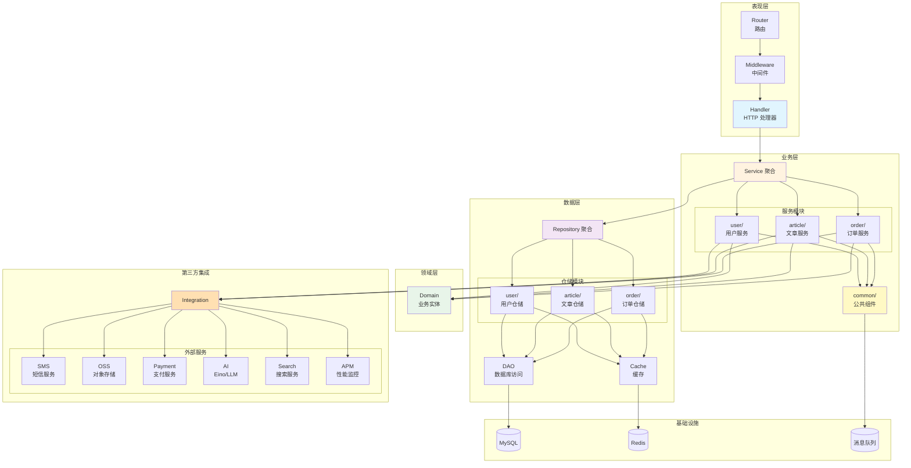
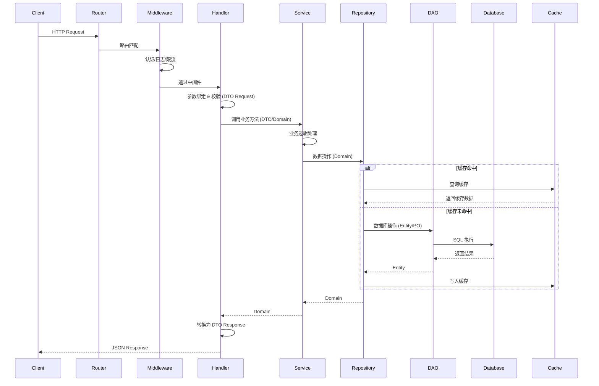
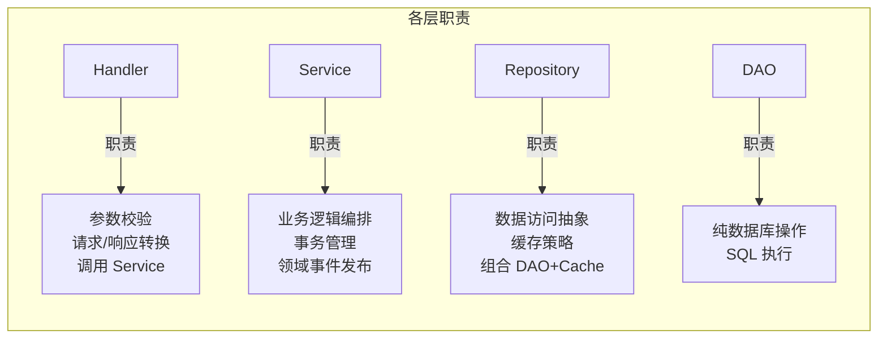
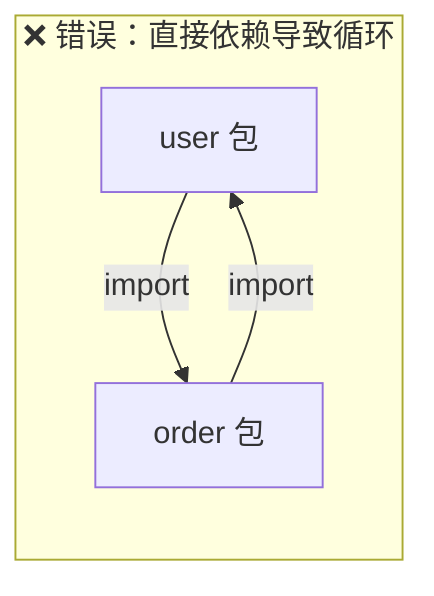
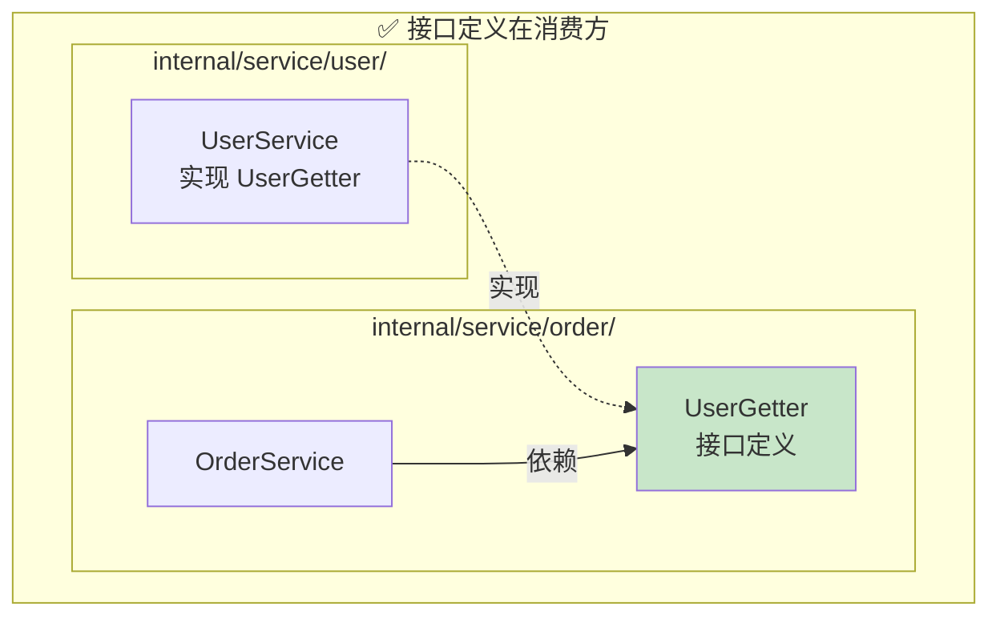
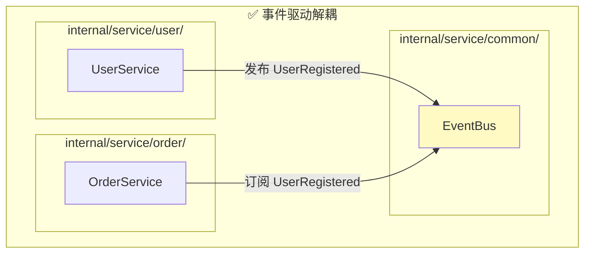
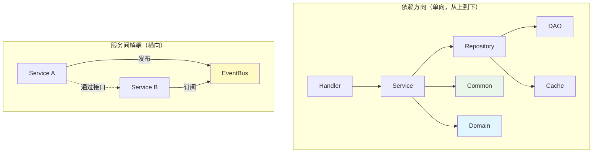
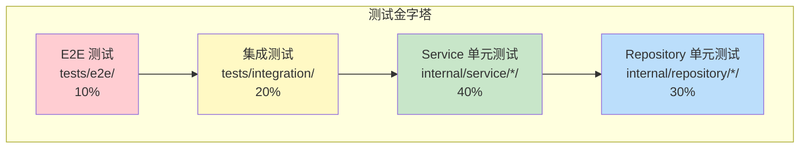
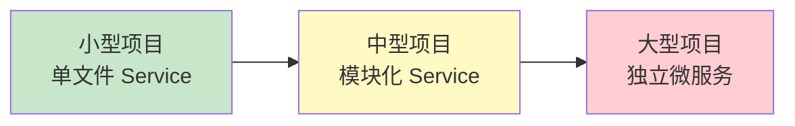
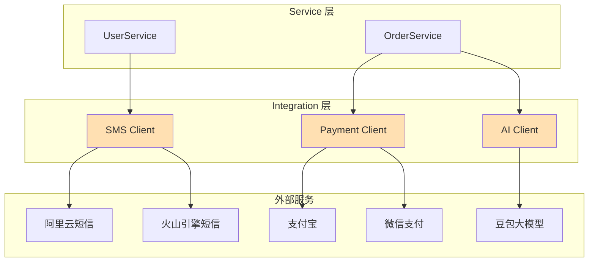

# 企业级 Go 单体应用架构设计

> 基于 Hertz 框架，支持业务规模化扩展，确保可测试、层次分离、易理解

---

## 目录结构

```
myapp/
├── cmd/                              # 应用入口
│   └── server/
│       └── main.go                   # 主程序入口
│
├── config/                           # 配置文件
│   ├── config.yaml                   # 默认配置
│   ├── config.dev.yaml               # 开发环境
│   ├── config.test.yaml              # 测试环境
│   └── config.prod.yaml              # 生产环境
│
├── internal/                         # 私有应用代码（不可被外部导入）
│   │
│   ├── domain/                       # 领域层：核心业务实体
│   │   ├── user.go                   # User 实体
│   │   ├── article.go                # Article 实体
│   │   ├── order.go                  # Order 实体
│   │   └── ...
│   │
│   ├── handler/                      # 表现层：HTTP 处理器
│   │   ├── user_handler.go           # 用户相关接口
│   │   ├── article_handler.go        # 文章相关接口
│   │   ├── order_handler.go          # 订单相关接口
│   │   └── middleware/               # HTTP 中间件
│   │       ├── auth.go               # 认证中间件
│   │       ├── cors.go               # 跨域中间件
│   │       ├── logging.go            # 日志中间件
│   │       └── recovery.go           # 异常恢复中间件
│   │
│   ├── service/                      # 业务逻辑层（模块化）
│   │   ├── service.go                # 服务聚合入口
│   │   │
│   │   ├── user/                     # 用户服务模块
│   │   │   ├── service.go            # 接口定义 + 结构体
│   │   │   ├── auth.go               # 登录、注册、密码重置
│   │   │   ├── profile.go            # 个人信息管理
│   │   │   ├── permission.go         # 权限、角色管理
│   │   │   ├── events.go             # 用户领域事件
│   │   │   └── service_test.go       # 单元测试
│   │   │
│   │   ├── article/                  # 文章服务模块
│   │   │   ├── service.go            # 接口定义
│   │   │   ├── crud.go               # 增删改查
│   │   │   ├── publish.go            # 发布、审核流程
│   │   │   ├── search.go             # 搜索相关
│   │   │   ├── stats.go              # 统计分析
│   │   │   └── service_test.go
│   │   │
│   │   ├── order/                    # 订单服务模块
│   │   │   ├── service.go            # 接口定义
│   │   │   ├── deps.go               # 外部依赖接口（解耦用）
│   │   │   ├── create.go             # 订单创建
│   │   │   ├── payment.go            # 支付处理
│   │   │   ├── refund.go             # 退款处理
│   │   │   └── service_test.go
│   │   │
│   │   ├── common/                   # 服务层公共组件
│   │   │   ├── transaction.go        # 跨服务事务管理
│   │   │   ├── event.go              # 领域事件总线
│   │   │   └── context.go            # 服务上下文
│   │   │
│   │   └── mocks/                    # 服务层 mock（测试用）
│   │       ├── user_service_mock.go
│   │       └── article_service_mock.go
│   │
│   ├── repository/                   # 数据访问层（模块化）
│   │   ├── repository.go             # 仓储聚合入口
│   │   │
│   │   ├── user/                     # 用户仓储模块
│   │   │   ├── repository.go         # 接口定义 + 实现
│   │   │   ├── cache.go              # 用户缓存策略
│   │   │   └── repository_test.go
│   │   │
│   │   ├── article/                  # 文章仓储模块
│   │   │   ├── repository.go
│   │   │   ├── cache.go
│   │   │   └── repository_test.go
│   │   │
│   │   ├── order/                    # 订单仓储模块
│   │   │   ├── repository.go
│   │   │   └── repository_test.go
│   │   │
│   │   ├── dao/                      # 数据库访问对象
│   │   │   ├── user.go               # 用户表操作
│   │   │   ├── user_entity.go        # 用户表实体（PO）
│   │   │   ├── article.go            # 文章表操作
│   │   │   ├── article_entity.go     # 文章表实体（PO）
│   │   │   ├── order.go              # 订单表操作
│   │   │   └── order_entity.go       # 订单表实体（PO）
│   │   │
│   │   └── mocks/                    # 仓储层 mock
│   │       └── user_repository_mock.go
│   │
│   ├── dto/                          # 数据传输对象
│   │   ├── request/                  # 请求 DTO
│   │   │   ├── user.go
│   │   │   ├── article.go
│   │   │   └── order.go
│   │   └── response/                 # 响应 DTO
│   │       ├── user.go
│   │       ├── article.go
│   │       └── order.go
│   │
│   ├── router/                       # 路由注册
│   │   ├── router.go                 # 主路由
│   │   ├── user.go                   # 用户路由
│   │   ├── article.go                # 文章路由
│   │   └── order.go                  # 订单路由
│   │
│   ├── ioc/                          # 依赖注入容器
│   │   ├── wire.go                   # Wire 依赖定义
│   │   ├── wire_gen.go               # Wire 生成代码
│   │   ├── db.go                     # 数据库初始化
│   │   ├── redis.go                  # Redis 初始化
│   │   ├── logger.go                 # 日志初始化
│   │   ├── event.go                  # 事件总线初始化
│   │   └── hertz.go                  # Hertz 服务初始化
│   │
│   ├── job/                          # 后台任务
│   │   ├── scheduler.go              # 定时任务调度
│   │   ├── cleanup.go                # 清理任务
│   │   └── notification.go           # 通知任务
│   │
│   └── integration/                  # 第三方服务集成
│       │
│       ├── sms/                      # 短信服务
│       │   ├── client.go             # 短信客户端接口
│       │   ├── aliyun.go             # 阿里云短信实现
│       │   ├── volcengine.go         # 火山引擎短信实现
│       │   └── mock.go               # Mock 实现（测试用）
│       │
│       ├── oss/                      # 对象存储服务
│       │   ├── client.go             # OSS 客户端接口
│       │   ├── aliyun.go             # 阿里云 OSS 实现
│       │   ├── volcengine.go         # 火山引擎 TOS 实现
│       │   └── local.go              # 本地存储实现（开发用）
│       │
│       ├── payment/                  # 支付服务
│       │   ├── client.go             # 支付客户端接口
│       │   ├── alipay.go             # 支付宝实现
│       │   ├── wechat.go             # 微信支付实现
│       │   └── callback.go           # 支付回调处理
│       │
│       ├── push/                     # 消息推送服务
│       │   ├── client.go             # 推送客户端接口
│       │   ├── jpush.go              # 极光推送实现
│       │   └── fcm.go                # Firebase 推送实现
│       │
│       ├── ai/                       # AI 服务集成
│       │   ├── client.go             # AI 客户端接口
│       │   │
│       │   ├── eino/                 # Eino 框架集成（字节跳动）
│       │   │   ├── agent.go          # Agent 智能体封装
│       │   │   ├── chain.go          # Chain 编排链
│       │   │   ├── retriever.go      # RAG 检索器
│       │   │   ├── tools.go          # 工具定义
│       │   │   └── prompt.go         # Prompt 模板
│       │   │
│       │   ├── openai.go             # OpenAI API 实现
│       │   ├── doubao.go             # 豆包大模型实现
│       │   └── embedding.go          # 向量嵌入服务
│       │
│       ├── search/                   # 搜索服务
│       │   ├── client.go             # 搜索客户端接口
│       │   ├── elasticsearch.go      # Elasticsearch 实现
│       │   └── meilisearch.go        # Meilisearch 实现
│       │
│       └── apm/                      # 应用性能监控
│           ├── tracer.go             # 链路追踪接口
│           ├── volcengine.go         # 火山引擎 APM 实现
│           └── otel.go               # OpenTelemetry 通用实现
│
├── pkg/                              # 可被外部导入的公共包
│   ├── errors/                       # 统一错误定义
│   │   ├── code.go                   # 错误码
│   │   └── errors.go                 # 错误类型
│   ├── response/                     # 统一响应格式
│   │   └── response.go
│   ├── logger/                       # 日志封装
│   │   └── logger.go
│   ├── validator/                    # 参数校验
│   │   └── validator.go
│   └── utils/                        # 工具函数
│       ├── string.go
│       ├── time.go
│       └── crypto.go
│
├── api/                              # API 文档
│   └── openapi.yaml                  # OpenAPI 规范
│
├── scripts/                          # 脚本
│   ├── build.sh                      # 构建脚本
│   ├── migrate.sh                    # 数据库迁移
│   └── gen_mock.sh                   # 生成 mock
│
├── deployments/                      # 部署配置
│   ├── docker/
│   │   └── Dockerfile
│   └── docker-compose.yaml
│
├── tests/                            # 集成测试
│   ├── integration/                  # 集成测试
│   │   ├── user_test.go
│   │   ├── order_test.go
│   │   └── testdata/                 # 测试数据
│   └── e2e/                          # 端到端测试
│       └── api_test.go
│
├── docs/                             # 项目文档
│   └── ARCHITECTURE.md               # 本文档
│
├── go.mod
├── go.sum
├── Makefile                          # 常用命令
└── README.md
```

---

## 分层架构图



---

## 数据流转图



---

## 核心设计原则

| 原则 | 说明 |
|------|------|
| **依赖倒置** | 高层不依赖低层，都依赖抽象（interface） |
| **单一职责** | Handler 只处理 HTTP，Service 只处理业务 |
| **接口隔离** | 大接口拆分为小接口，按需组合 |
| **可测试性** | 通过 interface + mock 实现各层独立测试 |
| **模块化** | 按业务领域拆分，避免单文件膨胀 |
| **事件驱动** | 跨模块通信优先使用事件解耦 |

---

## 各层职责说明



---

## 对象类型说明

| 对象类型 | 所在目录 | 用途 | 生命周期 |
|----------|----------|------|----------|
| **Domain** | `internal/domain/` | 核心业务实体，纯业务逻辑 | 贯穿全层 |
| **DTO Request** | `internal/dto/request/` | 接收客户端参数 | Handler 层 |
| **DTO Response** | `internal/dto/response/` | 返回给客户端的数据 | Handler 层 |
| **Entity (PO)** | `internal/repository/dao/` | 数据库表映射对象 | DAO 层 |
| **Event** | `internal/service/*/events.go` | 领域事件对象 | 服务间通信 |

---

## 服务模块拆分规范

### 何时拆分

| 行数 | 建议操作 |
|------|----------|
| < 300 行 | 保持单文件 |
| 300-500 行 | 考虑拆分 |
| > 500 行 | 必须拆分 |

### 拆分维度

1. **按业务功能** - `auth.go`, `profile.go`, `permission.go`
2. **按操作类型** - `crud.go`, `query.go`, `command.go`
3. **按数据流向** - `input.go`, `output.go`, `transform.go`

### 服务模块结构示例

```
internal/service/user/
├── service.go          # 接口定义 + 结构体 + 构造函数
├── auth.go             # 登录、注册、密码重置、Token 管理
├── profile.go          # 个人信息查询、更新、头像上传
├── permission.go       # 权限校验、角色管理、访问控制
├── events.go           # UserRegistered, UserLogin 等领域事件
└── service_test.go     # 单元测试
```

---

## 解决循环依赖

### 错误示例：直接依赖导致循环



### 正确方案一：接口定义在消费方



```go
// internal/service/order/deps.go
package order

import "context"

// UserGetter 订单服务需要的用户信息能力
// 定义在 order 包内，由 user 包实现
type UserGetter interface {
    GetUserByID(ctx context.Context, id int64) (*UserInfo, error)
}

// UserInfo 订单服务需要的用户信息（最小化字段）
type UserInfo struct {
    ID       int64
    Nickname string
    Level    int
}
```

### 正确方案二：事件驱动解耦



```go
// internal/service/common/event.go
package common

import "context"

type Event interface {
    EventName() string
}

type EventHandler func(ctx context.Context, event Event) error

type EventBus interface {
    Publish(ctx context.Context, event Event) error
    Subscribe(eventName string, handler EventHandler)
}
```

```go
// internal/service/user/events.go
package user

import "time"

type UserRegisteredEvent struct {
    UserID    int64
    Email     string
    Timestamp time.Time
}

func (e UserRegisteredEvent) EventName() string {
    return "user.registered"
}
```

---

## 依赖方向原则



**核心规则**：

1. **单向依赖** - 依赖方向始终保持一致，禁止反向依赖
2. **接口隔离** - 接口定义在消费方，实现方按需实现
3. **事件解耦** - 跨模块通信优先使用事件总线
4. **最小知识** - 每个模块只暴露必要的接口

---

## 代码示例

### 1. 服务接口定义

```go
// internal/service/user/service.go
package user

import (
    "context"
    "myapp/internal/domain"
)

// UserService 用户服务主接口（组合多个子接口）
type UserService interface {
    UserAuthService
    UserProfileService
    UserPermissionService
}

// UserAuthService 认证相关
type UserAuthService interface {
    Login(ctx context.Context, req *LoginReq) (*LoginResp, error)
    Register(ctx context.Context, req *RegisterReq) error
    ResetPassword(ctx context.Context, req *ResetPasswordReq) error
}

// UserProfileService 个人信息
type UserProfileService interface {
    GetProfile(ctx context.Context, userID int64) (*domain.User, error)
    UpdateProfile(ctx context.Context, req *UpdateProfileReq) error
}

// UserPermissionService 权限管理
type UserPermissionService interface {
    CheckPermission(ctx context.Context, userID int64, resource string) (bool, error)
    AssignRole(ctx context.Context, userID int64, roleID int64) error
}

// userService 实现
type userService struct {
    repo     UserRepository
    eventBus common.EventBus
    cache    UserCache
}

func NewUserService(repo UserRepository, eventBus common.EventBus, cache UserCache) UserService {
    return &userService{
        repo:     repo,
        eventBus: eventBus,
        cache:    cache,
    }
}
```

### 2. 服务实现拆分

```go
// internal/service/user/auth.go
package user

import (
    "context"
    "myapp/internal/service/common"
)

func (s *userService) Login(ctx context.Context, req *LoginReq) (*LoginResp, error) {
    // 1. 验证用户
    user, err := s.repo.GetByEmail(ctx, req.Email)
    if err != nil {
        return nil, err
    }

    // 2. 验证密码
    if !user.CheckPassword(req.Password) {
        return nil, ErrInvalidPassword
    }

    // 3. 生成 Token
    token, err := s.generateToken(user)
    if err != nil {
        return nil, err
    }

    // 4. 发布登录事件
    s.eventBus.Publish(ctx, UserLoginEvent{
        UserID:    user.ID,
        IP:        req.IP,
        Timestamp: time.Now(),
    })

    return &LoginResp{Token: token, User: user}, nil
}

func (s *userService) Register(ctx context.Context, req *RegisterReq) error {
    // 注册逻辑...

    // 发布注册事件
    s.eventBus.Publish(ctx, UserRegisteredEvent{
        UserID:    user.ID,
        Email:     user.Email,
        Timestamp: time.Now(),
    })

    return nil
}
```

```go
// internal/service/user/profile.go
package user

import (
    "context"
    "myapp/internal/domain"
)

func (s *userService) GetProfile(ctx context.Context, userID int64) (*domain.User, error) {
    // 1. 尝试从缓存获取
    if user, err := s.cache.Get(ctx, userID); err == nil {
        return user, nil
    }

    // 2. 从数据库获取
    user, err := s.repo.GetByID(ctx, userID)
    if err != nil {
        return nil, err
    }

    // 3. 写入缓存
    s.cache.Set(ctx, user)

    return user, nil
}

func (s *userService) UpdateProfile(ctx context.Context, req *UpdateProfileReq) error {
    // 更新逻辑...

    // 清除缓存
    s.cache.Delete(ctx, req.UserID)

    return nil
}
```

### 3. 服务聚合入口

```go
// internal/service/service.go
package service

import (
    "myapp/internal/service/user"
    "myapp/internal/service/article"
    "myapp/internal/service/order"
    "myapp/internal/service/common"
)

// Services 聚合所有服务，用于依赖注入
type Services struct {
    User     user.UserService
    Article  article.ArticleService
    Order    order.OrderService
    EventBus common.EventBus
}

func NewServices(
    userSvc user.UserService,
    articleSvc article.ArticleService,
    orderSvc order.OrderService,
    eventBus common.EventBus,
) *Services {
    return &Services{
        User:     userSvc,
        Article:  articleSvc,
        Order:    orderSvc,
        EventBus: eventBus,
    }
}
```

### 4. 订单服务依赖用户服务（接口解耦）

```go
// internal/service/order/deps.go
package order

import "context"

// UserGetter 订单服务依赖的用户能力（最小接口）
type UserGetter interface {
    GetUserByID(ctx context.Context, id int64) (*UserInfo, error)
}

type UserInfo struct {
    ID       int64
    Nickname string
    Level    int  // 会员等级，影响折扣
}
```

```go
// internal/service/order/service.go
package order

type orderService struct {
    repo       OrderRepository
    userGetter UserGetter  // 依赖接口，不依赖 user 包
    eventBus   common.EventBus
}

func NewOrderService(
    repo OrderRepository,
    userGetter UserGetter,
    eventBus common.EventBus,
) OrderService {
    return &orderService{
        repo:       repo,
        userGetter: userGetter,
        eventBus:   eventBus,
    }
}
```

### 5. Wire 依赖注入

```go
// internal/ioc/wire.go
//go:build wireinject

package ioc

import (
    "github.com/google/wire"
    "myapp/internal/service"
    "myapp/internal/service/user"
    "myapp/internal/service/article"
    "myapp/internal/service/order"
    "myapp/internal/service/common"
    "myapp/internal/repository"
)

var commonSet = wire.NewSet(
    common.NewEventBus,
)

var repositorySet = wire.NewSet(
    repository.NewUserRepository,
    repository.NewArticleRepository,
    repository.NewOrderRepository,
)

var serviceSet = wire.NewSet(
    // User 服务
    user.NewUserService,
    // User 服务同时实现 order.UserGetter 接口
    wire.Bind(new(order.UserGetter), new(*user.userService)),

    // Article 服务
    article.NewArticleService,

    // Order 服务
    order.NewOrderService,

    // 聚合
    service.NewServices,
)

func InitApp() (*App, error) {
    wire.Build(
        // 基础设施
        InitDB,
        InitRedis,
        InitLogger,

        // 公共组件
        commonSet,

        // Repository 层
        repositorySet,

        // Service 层
        serviceSet,

        // Handler 层
        handlerSet,

        // Router
        router.NewRouter,

        // App
        NewApp,
    )
    return nil, nil
}
```

---

## 测试策略



**测试文件位置**：

| 测试类型 | 位置 | 说明 |
|----------|------|------|
| 单元测试 | 与被测文件同目录 | `*_test.go` |
| 集成测试 | `tests/integration/` | 测试模块间交互 |
| E2E 测试 | `tests/e2e/` | 完整 API 流程测试 |

---

## 配置文件示例

```yaml
# config/config.yaml
server:
  host: "0.0.0.0"
  port: 8080
  mode: "debug"  # debug, release, test

db:
  driver: "mysql"
  dsn: "root:password@tcp(localhost:3306)/myapp?charset=utf8mb4&parseTime=True&loc=Local"
  max_idle_conns: 10
  max_open_conns: 100
  conn_max_lifetime: 3600

redis:
  addr: "localhost:6379"
  password: ""
  db: 0
  pool_size: 100

log:
  level: "info"
  format: "json"
  output: "stdout"

jwt:
  secret: "your-secret-key"
  expire: 24h
  refresh_expire: 168h  # 7 days

event:
  driver: "memory"  # memory, redis, kafka
  buffer_size: 1000
```

---

## Makefile 示例

```makefile
.PHONY: build run test wire mock lint clean

# 构建
build:
	go build -o bin/server ./cmd/server

# 运行
run:
	go run ./cmd/server

# 测试
test:
	go test -v -cover ./...

# 单元测试
test-unit:
	go test -v -cover ./internal/...

# 集成测试
test-integration:
	go test -v ./tests/integration/...

# 生成 Wire 代码
wire:
	cd internal/ioc && wire

# 生成 Mock
mock:
	@echo "Generating mocks..."
	mockgen -source=internal/service/user/service.go \
		-destination=internal/service/mocks/user_service_mock.go
	mockgen -source=internal/service/article/service.go \
		-destination=internal/service/mocks/article_service_mock.go
	mockgen -source=internal/repository/user/repository.go \
		-destination=internal/repository/mocks/user_repository_mock.go

# 代码检查
lint:
	golangci-lint run

# 格式化
fmt:
	go fmt ./...
	goimports -w .

# 数据库迁移
migrate:
	go run ./scripts/migrate.go

# 清理
clean:
	rm -rf bin/

# 开发环境启动（热重载）
dev:
	air -c .air.toml
```

---

## 设计优势总结

| 特性 | 说明 |
|------|------|
| **可测试** | 每层通过 interface 定义，可独立 mock 测试 |
| **层次分离** | Handler → Service → Repository → DAO 职责清晰 |
| **模块化** | 按业务领域拆分，避免单文件膨胀 |
| **解耦合** | 接口隔离 + 事件驱动，避免循环依赖 |
| **可扩展** | 新增业务模块只需添加目录，不影响现有代码 |
| **易理解** | 扁平化设计，目录结构即架构图 |
| **企业级** | 配置管理、依赖注入、事件驱动、完整测试体系 |

---

## 演进路径



| 阶段 | 特征 | 结构 |
|------|------|------|
| 小型项目 | < 5 个实体，< 20 个接口 | 单文件 Service |
| 中型项目 | 5-20 个实体，20-100 个接口 | 模块化 Service（本设计） |
| 大型项目 | > 20 个实体，> 100 个接口 | 拆分为独立微服务 |

本设计支持从小型项目平滑演进到中型项目，当业务继续增长时，各模块可独立拆分为微服务。

---

## 第三方服务集成规范

### 目录结构说明

```
internal/integration/
├── sms/                # 短信服务 - 验证码、通知
├── oss/                # 对象存储 - 文件上传、图片处理
├── payment/            # 支付服务 - 支付、退款、回调
├── push/               # 消息推送 - APP 推送、站内信
├── ai/                 # AI 服务 - LLM、RAG、Agent
│   └── eino/           # Eino 框架专属目录
├── search/             # 搜索服务 - 全文检索
└── apm/                # 性能监控 - 链路追踪、指标
```

### 接口设计原则

每个第三方服务模块遵循统一的接口设计模式：

```go
// internal/integration/sms/client.go
package sms

import "context"

// Client 短信客户端接口
type Client interface {
    // SendCode 发送验证码
    SendCode(ctx context.Context, phone, code string) error
    // SendTemplate 发送模板短信
    SendTemplate(ctx context.Context, phone, templateID string, params map[string]string) error
}

// Config 短信服务配置
type Config struct {
    Provider    string // aliyun, volcengine
    AccessKey   string
    SecretKey   string
    SignName    string
    TemplateID  string
}

// NewClient 根据配置创建对应的客户端
func NewClient(cfg Config) (Client, error) {
    switch cfg.Provider {
    case "aliyun":
        return NewAliyunClient(cfg)
    case "volcengine":
        return NewVolcengineClient(cfg)
    default:
        return NewMockClient(), nil
    }
}
```

### Eino 框架集成

[Eino](https://github.com/cloudwego/eino) 是字节跳动开源的 Go 语言 AI 应用开发框架：

```
internal/integration/ai/eino/
├── agent.go        # Agent 智能体 - ReAct、Function Calling
├── chain.go        # Chain 编排 - 多步骤工作流
├── retriever.go    # RAG 检索 - 向量检索、重排序
├── tools.go        # 工具定义 - 自定义工具函数
└── prompt.go       # Prompt 模板 - ChatTemplate
```

```go
// internal/integration/ai/eino/agent.go
package eino

import (
    "context"

    "github.com/cloudwego/eino/components/model"
    "github.com/cloudwego/eino/compose"
    "github.com/cloudwego/eino/flow/agent/react"
)

// Agent AI 智能体封装
type Agent struct {
    model  model.ChatModel
    tools  []model.Tool
    config *AgentConfig
}

// AgentConfig 智能体配置
type AgentConfig struct {
    ModelName   string   // doubao-pro-32k, gpt-4, etc.
    MaxSteps    int      // 最大推理步数
    Temperature float64  // 温度参数
}

// NewAgent 创建智能体
func NewAgent(cfg *AgentConfig) (*Agent, error) {
    // 初始化模型
    chatModel, err := model.NewChatModel(cfg.ModelName)
    if err != nil {
        return nil, err
    }

    return &Agent{
        model:  chatModel,
        config: cfg,
    }, nil
}

// Chat 对话
func (a *Agent) Chat(ctx context.Context, query string) (string, error) {
    agent, err := react.NewAgent(ctx, &react.AgentConfig{
        Model: a.model,
        Tools: a.tools,
    })
    if err != nil {
        return "", err
    }

    result, err := agent.Generate(ctx, []*schema.Message{
        schema.UserMessage(query),
    })
    if err != nil {
        return "", err
    }

    return result.Content, nil
}

// RegisterTool 注册工具
func (a *Agent) RegisterTool(tool model.Tool) {
    a.tools = append(a.tools, tool)
}
```

```go
// internal/integration/ai/eino/chain.go
package eino

import (
    "context"

    "github.com/cloudwego/eino/compose"
)

// Chain RAG 检索增强生成链
type Chain struct {
    retriever Retriever
    model     model.ChatModel
}

// Build 构建 Chain
func (c *Chain) Build(ctx context.Context) (*compose.Graph, error) {
    graph := compose.NewGraph()

    // 添加节点
    graph.AddNode("retrieve", c.retriever)
    graph.AddNode("generate", c.model)

    // 添加边
    graph.AddEdge(compose.START, "retrieve")
    graph.AddEdge("retrieve", "generate")
    graph.AddEdge("generate", compose.END)

    return graph.Compile(ctx)
}
```

### 集成层与服务层交互



### 服务注入配置

```go
// internal/ioc/integration.go
package ioc

import (
    "myapp/internal/integration/sms"
    "myapp/internal/integration/oss"
    "myapp/internal/integration/payment"
    "myapp/internal/integration/ai"
    "myapp/internal/integration/ai/eino"
)

// InitSMSClient 初始化短信客户端
func InitSMSClient(cfg *config.Config) (sms.Client, error) {
    return sms.NewClient(sms.Config{
        Provider:   cfg.SMS.Provider,
        AccessKey:  cfg.SMS.AccessKey,
        SecretKey:  cfg.SMS.SecretKey,
        SignName:   cfg.SMS.SignName,
    })
}

// InitAIAgent 初始化 AI 智能体
func InitAIAgent(cfg *config.Config) (*eino.Agent, error) {
    return eino.NewAgent(&eino.AgentConfig{
        ModelName:   cfg.AI.ModelName,
        MaxSteps:    cfg.AI.MaxSteps,
        Temperature: cfg.AI.Temperature,
    })
}

// InitPaymentClient 初始化支付客户端
func InitPaymentClient(cfg *config.Config) (payment.Client, error) {
    return payment.NewClient(payment.Config{
        Alipay: payment.AlipayConfig{
            AppID:      cfg.Payment.Alipay.AppID,
            PrivateKey: cfg.Payment.Alipay.PrivateKey,
        },
        Wechat: payment.WechatConfig{
            AppID:     cfg.Payment.Wechat.AppID,
            MchID:     cfg.Payment.Wechat.MchID,
            APIKey:    cfg.Payment.Wechat.APIKey,
        },
    })
}
```

### 配置文件扩展

```yaml
# config/config.yaml

# 短信服务配置
sms:
  provider: "volcengine"  # aliyun, volcengine
  access_key: "${SMS_ACCESS_KEY}"
  secret_key: "${SMS_SECRET_KEY}"
  sign_name: "MyApp"
  templates:
    verify_code: "SMS_001"
    notification: "SMS_002"

# 对象存储配置
oss:
  provider: "volcengine"  # aliyun, volcengine
  access_key: "${OSS_ACCESS_KEY}"
  secret_key: "${OSS_SECRET_KEY}"
  bucket: "myapp-bucket"
  region: "cn-beijing"
  endpoint: "tos-cn-beijing.volces.com"

# 支付服务配置
payment:
  alipay:
    app_id: "${ALIPAY_APP_ID}"
    private_key: "${ALIPAY_PRIVATE_KEY}"
    notify_url: "https://api.myapp.com/payment/alipay/callback"
  wechat:
    app_id: "${WECHAT_APP_ID}"
    mch_id: "${WECHAT_MCH_ID}"
    api_key: "${WECHAT_API_KEY}"
    notify_url: "https://api.myapp.com/payment/wechat/callback"

# AI 服务配置
ai:
  provider: "doubao"  # doubao, openai
  model_name: "doubao-pro-32k"
  api_key: "${AI_API_KEY}"
  base_url: "https://ark.cn-beijing.volces.com/api/v3"
  max_steps: 10
  temperature: 0.7

  # Eino RAG 配置
  rag:
    enabled: true
    vector_store: "milvus"
    embedding_model: "doubao-embedding"
    chunk_size: 500
    chunk_overlap: 50

# 搜索服务配置
search:
  provider: "elasticsearch"  # elasticsearch, meilisearch
  hosts:
    - "http://localhost:9200"
  index_prefix: "myapp_"

# APM 配置
apm:
  provider: "volcengine"
  endpoint: "https://apmplus-cn-beijing.volces.com"
  service_name: "myapp"
  sample_rate: 1.0
```

### 集成测试策略

| 服务类型 | 测试方式 | Mock 策略 |
|----------|----------|-----------|
| 短信服务 | Mock Client | 返回成功，记录调用参数 |
| 支付服务 | 沙箱环境 | 使用支付平台沙箱 |
| AI 服务 | Mock 响应 | 返回预设的 AI 响应 |
| OSS 服务 | 本地存储 | 开发环境使用本地文件系统 |
| 搜索服务 | 内存实现 | 使用 map 模拟搜索 |

```go
// internal/integration/sms/mock.go
package sms

import (
    "context"
    "sync"
)

// MockClient 测试用 Mock 客户端
type MockClient struct {
    mu       sync.Mutex
    messages []SendRecord
}

type SendRecord struct {
    Phone    string
    Code     string
    Template string
    Params   map[string]string
}

func NewMockClient() *MockClient {
    return &MockClient{}
}

func (m *MockClient) SendCode(ctx context.Context, phone, code string) error {
    m.mu.Lock()
    defer m.mu.Unlock()
    m.messages = append(m.messages, SendRecord{Phone: phone, Code: code})
    return nil
}

func (m *MockClient) SendTemplate(ctx context.Context, phone, templateID string, params map[string]string) error {
    m.mu.Lock()
    defer m.mu.Unlock()
    m.messages = append(m.messages, SendRecord{Phone: phone, Template: templateID, Params: params})
    return nil
}

// GetMessages 获取发送记录（测试用）
func (m *MockClient) GetMessages() []SendRecord {
    m.mu.Lock()
    defer m.mu.Unlock()
    return m.messages
}
```